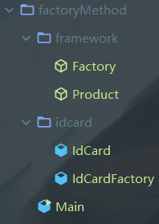
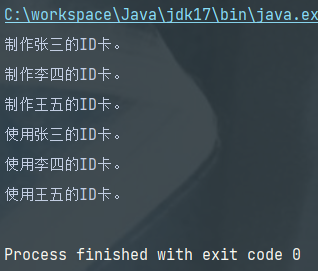
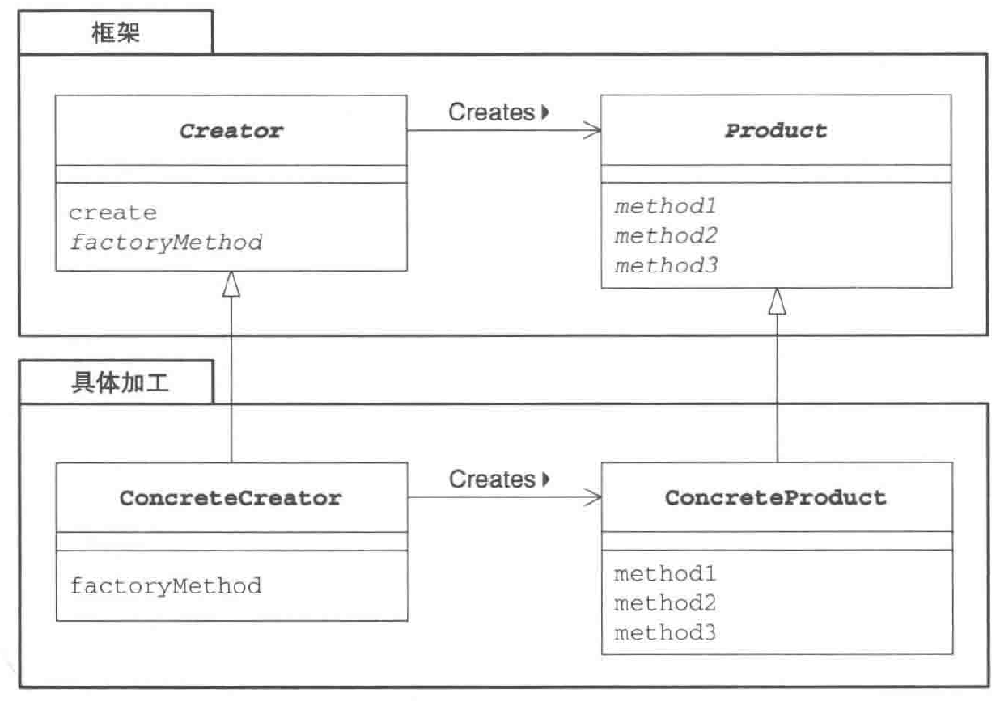

## Factory Method模式：将实例的生成交给子类
- 父类决定实例的生成方式，但不决定所要生成的具体的类，具体处理交给子类。
- 将生成实例的框架与实际负责生成实例的类解耦。
## code list
  
## 角色
### 类图

### Product（产品）
- 框架中的抽象类，定义了在Factory Method模式中生成的实例所持有的接口。
- CodeList中的Product。
### Creator（创建者）
- 负责生成Product的抽象类，具体的处理交给子类。
- CodeList中Factory。
- creator角色对于实际负责生成实例的ConcreteCreator角色一无所知，只知道**只要调用Product角色和生成实例的方法，就可以生成Product实例。**
- 这样，不用new关键字，而是**调用生成实例的专用方法**，防止父类与具体类的耦合。
### ConcreteProduct（具体的产品）
- 具体加工，子类，决定了具体的产品。
### ConcreteCreator（具体的创建者）
- 子类。负责生产具体的产品。
## keys
### 框架与具体加工
框架所在的包framework不依赖于具体加工（产品）的包。
### 生成实例——方法的三种实现方式
1. 指定其为抽象方法
2. 为其实现默认处理：
在类中实现默认处理，子类继承但没有重写时则应用默认处理。

    `class Factory {
    public Product createProduct(String owner) {
    return new Product(name);
    }
    ...
    }`

3. 在其中抛出异常
## 相关设计模式
1. Template Method模式
2. Singleton模式
3. Composite模式
4. Iterator模式
## 练习：
1. IdCard类中的构造方法并非 public 的，为何？  
权限修饰符， default（即不写） 访问范围在同一个包。 这让 idcard 包外的类无法 new 出 IdCard 实例。强制外部必须使用 IdCardFactory 来生成实例。
2. 为IdCard类添加卡的编号，并在IdCardFactory类中保存编号与所有者之间的对应表。