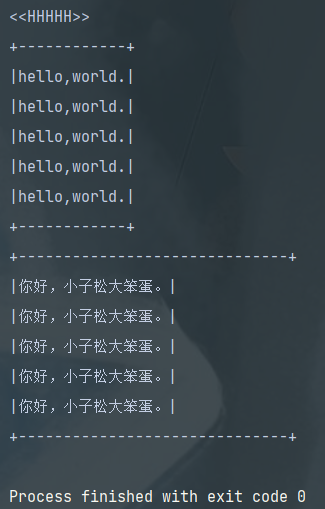

## 模板
## Template Method模式：将具体处理交给子类
- 在**父类中定义处理流程的框架**，在**子类中实现具体处理**的模式。
- 使用**继承**改变程序的行为。
## code list

## 角色
### AbstractClass
- 负责实现模板方法，声明在模板方法中定义的抽象方法。抽象方法则由子类 ConcreteClass 实现。
- AbstractDisplay
### ConcreteClass
- 实现抽象方法。实现的方法会在AbstractClass中被调用。
## keys
- 使逻辑处理通用化：即在父类模板中编写的算法，一旦有bug或者修改，只需改一处，而非每个子类都改一次。
- 父类子类的协作：理解抽象方法被调用的时机。
- 父类与子类的一致性：使用父类类型的变量保存子类实例。（里氏替换原则）
## 相关设计模式
- Factory Method模式
- Strategy模式：与 Template Method相比，使用**委托**改变程序行为。
## 类的层次与抽象类
- 父类对子类的要求
- 抽象类の意义
- 父类与子类间的协作
## 练习：
1. java.io.InputStream类中使用了Template Method模式。阅读官方文档，找出需要用java.io.InputStream的子类去实现的方法。  
   在子类中需要实现的方法是 java.io.InputStream 的 read 方法（不带参数）。read 方法会被 java.io.InputStream 的模板方法 read(byte[] b, int off, int len) 循环调用。也就是说，程序中是子类负责实现具体的“读取1个字节”的处理，而在 java.io.InputStream 中只定义了“将指定数量的字节读取到数组中的指定位置”这个模板方法。
2. 本例中的 AbstractDisplay 类中 display 方法使用了 final 修饰符，为何？  
   因为不想让继承的子类重写此方法。这个方法是父类模板中定义好的处理流程框架，只应由父类来实现。
3. 想让本例中的 open, print, close 方法可以被具有继承关系的类和同一程序包中的类调用，但不能被无关的其他类调用，该如何做？  
   将AbstractDisplay中的 open, close, print 方法限定为 protected 即可。
4. 接口同样是抽象方法的集合，为何Template Method模式中，无法使用接口来扮演AbstractClass角色？  
   因为AbstractClass必须实现处理的流程。在抽象类中可以实现一部分方法，但是接口中不行。  
   所以，在TemplateMethod模式中，接口无法取代抽象类。